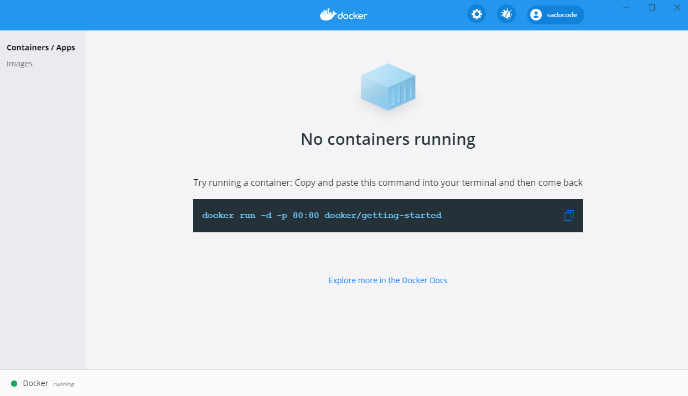

# Use Cases \#1

## Docker 다운로드 및 설치

### 1. 다운로

다운로드 링크 : [https://hub.docker.com/editions/community/docker-ce-desktop-windows/](https://hub.docker.com/editions/community/docker-ce-desktop-windows/)

### 2. 설치

Windows에서 Docker 사용을 위해 Hyper-V, WSL2를 꼭 체크해준다.

아래와 같은 에러가 발생할 경우, BIOS를 띄운다.

BIOS에서 Security &gt; Credential Guard를 Enabled 시킨다.

